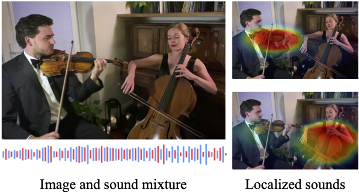

# Mix and Localize: Localizing Sound Sources in Mixtures

<h4>
Xixi Hu*, Ziyang Chen*,Andrew Owens
</br>
<span style="font-size: 14pt; color: #555555">
University of Michigan
</span>
</br>
CVPR 2022
</h4>
<hr>

This repository contains the official codebase for [Mix and Localize: Localizing Sound Sources in Mixtures](https://openaccess.thecvf.com/content/CVPR2022/html/Hu_Mix_and_Localize_Localizing_Sound_Sources_in_Mixtures_CVPR_2022_paper.html). [[Project Page](https://hxixixh.github.io/mix-and-localize/)]


<div align="center">
  
</div>


## MUSIC Dataset
1. Download the MUSIC dataset here: [MUSIC repo](https://github.com/roudimit/MUSIC_dataset)
2. Postprocess the MUSIC dataset and extract the frames and audio clips. The structure of the dataset folder is as follow. 

    ```
    data
      └──MUSIC 
      │    ├──data-splits
      │    ├──MUSIC_raw
      │           ├──duet
      │           ├──solo
      │                └── [class_label]
      │                         └── [ytid]
      │                               ├── audio
      │                               │      ├──audio_clips
      │                               │             ├── 00000.wav       # 1 second audio clips
      │                               │             ├── 00001.wav
      │                               │             ├── ...
      │                               └── frames
      │                                      ├── 00000.jpg              # fps = 4
      │                                      ├── ...

    ```

## Training on MUSIC dataset
```bash
python train.py --setting="music_multi_nodes" --exp="exp_music" --batch_size=128 --epoch=30 
```

You can also download the pretrained model for MUSIC dataset [here](https://drive.google.com/file/d/17lKKMPxCrrQA168d_NzNQdaiVh4waC2i/view?usp=sharing)

## VoxCeleb Dataset
1. Download the VoxCeleb2 dataset here: [VoxCeleb repo](https://github.com/clovaai/voxceleb_trainer)
2. Postprocess the VoxCeleb2 dataset and extract the frames and audio clips. The structure of the dataset folder is as follow. 

    ```
    data
      └── VoxCeleb 
      │    ├──data-splits
      │    ├──VoxCeleb2
      │            └── [idxxxxx]
      │                      └── [video_clip_name]  # 5s clip 
      │                               ├── audio
      │                               │      └── audio.wav
      │                               └── frames
      │                                      ├── frame000001.jpg              # fps = 10
      │                                      ├── ...

    ```

## Training on VoxCeleb dataset
```bash
python train.py --setting="voxceleb_multi_nodes" --exp="exp_voxceleb" --batch_size=128 --lr=1e-4 --epoch=30 
```

You can also download the pretrained model for VoxCeleb2 dataset [here](https://drive.google.com/file/d/17lp67P4YuGv6ZXnCr8vTgoujIiA1xkXy/view?usp=sharing)